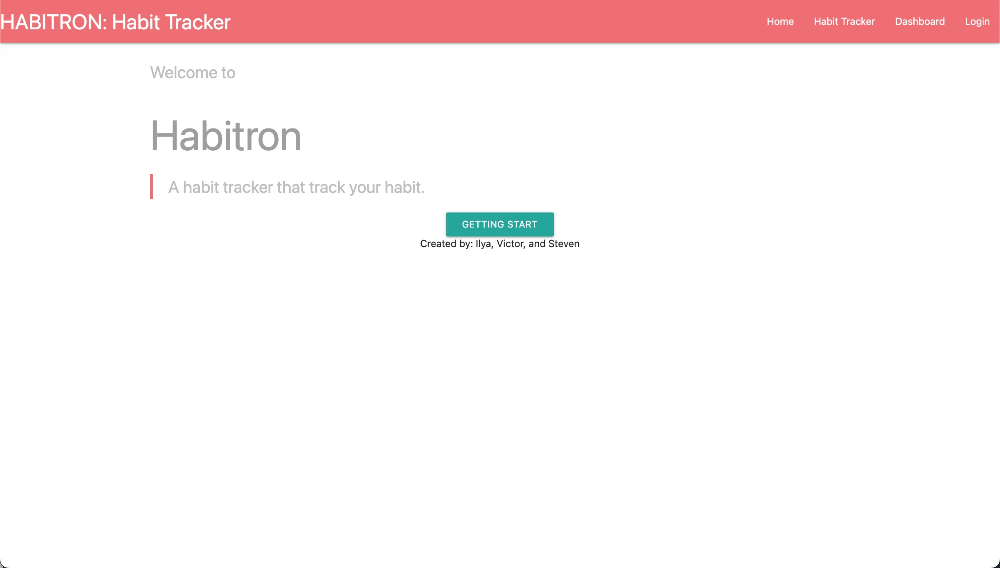
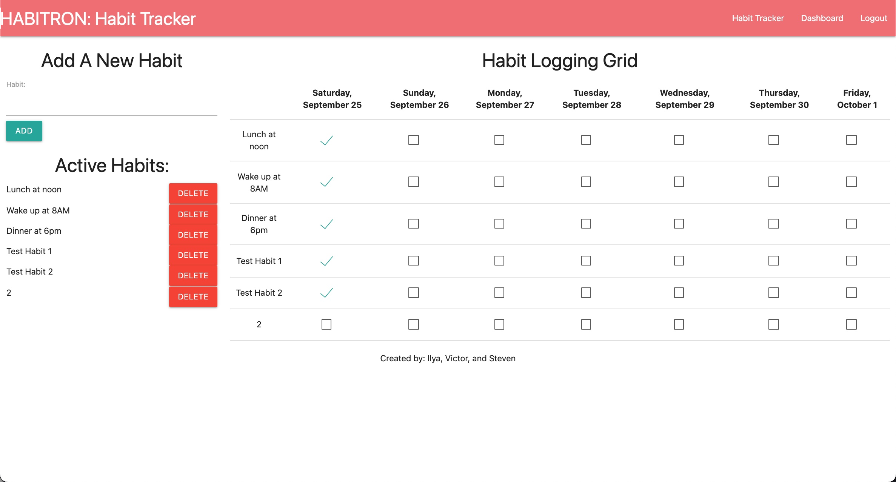

# Habitron
## Description
 A Habit Tracker keep track of your habits. Built using Materialize, Chart.js, MySQL2, Express, Sequelize, bcrypt, Session, Handlebars and dotenv.

Repository: 
    https://github.com/xaker00/habitron

Deployment:
    
     
Demo
    

## Table of Contents
1. [Installation](#installation)

2. [Usage](#usage)

3. [Credits](#credits)

4. [License](#license)

5. [Features](#features)

6. [Contribute](#contribute)

7. [Questions](#questions)

## Installation
    1. Run "npm install" to install all dependencies
    2. Run "npm run seed" to add sample data

## Usage
   1. Open terminal
   2. Run 'npm start'
   3. Open http://localhost:3001/ from browser
   
   
## Credits
    Ilya Spivakov, Steven Chung and Victor Lam

## License

## Features
This application provided following functionality:

    * Sign up account, login , logout
    * Create/edit/delete habit
    * Dashboard view current habit tracking progress

## Contribute
    Ilya Spivakov, Steven Chung and Victor Lam

## Questions
Questions about this repository? Please contact us at GitHub at 
[Ilya Spivakov](https://github.com/xaker00)
[Steven Chung](https://github.com/skchung93)
[Victor Lam](https://github.com/mingmanhk)